# Arch Linux Installation Guide

A modular, phased installation guide for Arch Linux with Hyprland. Each phase produces a **usable system** at a defined milestone.

| Phase | Milestone | Status |
|-------|-----------|--------|
| [**Phase 0: Pre-Install**](./phase-0-pre-install/README.md) | Ready to install | BIOS, USB, drive ID |
| [**Phase 1: Base System**](./phase-1-base-system/README.md) | Bootable CLI (TTY) | Btrfs, GRUB, dual-boot |
| [**Phase 2: System Hardening**](./phase-2-system-hardening/README.md) | Stable + drivers | NVIDIA, snapshots, audio, SSH |
| [**Phase 3: Desktop**](./phase-3-desktop/README.md) | Graphical desktop | Hyprland + desktop tools |
| [**Phase 4: Workflow**](./phase-4-workflow/README.md) | Daily driver | Dev / Gaming / Creative profiles |

## Quick Links

- [Feature Parity Reference](./reference/feature-parity.md) — Windows → Linux equivalents
- [Package List](./reference/package-list.md) — All packages by phase
- [Manifest](./manifest.yaml) — Module metadata (single source of truth)

## Dependency Chart

```mermaid
flowchart TD

    subgraph phase_0["📋 Phase: Pre-Install"]
        overview(["System Overview"])
        pre_flight(["Pre-Flight Checklist"])
    end

    subgraph phase_1["🖥️ Phase: Base System"]
        verify_boot(["Verify Boot & Network"])
        partitioning(["Partitioning"])
        filesystems(["Filesystems & Btrfs Subvolumes"])
        install_base(["Install Base Packages"])
        system_config(["System Configuration"])
        users_sudo(["Users & Sudo"])
        bootloader(["Bootloader (GRUB)"])
        first_reboot(["First Reboot"])
    end

    subgraph phase_2["🛡️ Phase: System Hardening"]
        nvidia(["NVIDIA Drivers"])
        snapshots(["Btrfs Snapshots & Recovery"])
        aur(["AUR Helper (yay)"])
        sound(["Sound (PipeWire)"])
        networking{{"Wi-Fi & Bluetooth"}}
        clock_sync{{"Clock Sync (Dual-Boot)"}}
        firewall{{"Firewall"}}
        external_drives{{"External Drives & NTFS"}}
        ssh(["SSH & Git"])
    end

    subgraph phase_3["🪟 Phase: Desktop"]
        hyprland_install(["Install Hyprland"])
        hyprland_config(["Hyprland Core Config"])
        hyprland_lock(["Lock & Idle"])
        hyprland_wallpaper{{"Wallpaper"}}
        hyprland_screenshare(["Screen Sharing"])
        shell_terminal(["Shell & Terminal"])
        app_launcher(["App Launcher"])
        status_bar(["Status Bar"])
        notifications(["Notifications"])
        display_manager{{"Display Manager"}}
        clipboard(["Clipboard"])
        screenshots{{"Screenshots"}}
        file_manager(["File Manager"])
        fonts(["Fonts"])
    end

    subgraph phase_4["🚀 Phase: Workflow"]
        dotfiles(["Dotfiles Backup (GNU Stow)"])
        subgraph profile_dev["Developer"]
            neovim(["NeoVim"])
            containers{{"Containers (Podman)"}}
            devpod{{"DevPod"}}
            local_ai{{"Local AI Models"}}
            languages{{"Language Runtimes"}}
            api_testing{{"API Testing"}}
        end
        subgraph profile_gaming["Gaming"]
            steam(["Steam"])
            proton(["Proton & ProtonGE"])
            heroic{{"Heroic Launcher"}}
            mangohud{{"MangoHud"}}
            controllers{{"Controllers"}}
        end
        subgraph profile_creative["Creative"]
            obs{{"OBS Studio"}}
            davinci{{"DaVinci Resolve"}}
            media_players{{"Media Players"}}
        end
    end

    %% Prerequisites
    overview --> pre_flight
    pre_flight --> verify_boot
    verify_boot --> partitioning
    partitioning --> filesystems
    filesystems --> install_base
    install_base --> system_config
    system_config --> users_sudo
    users_sudo --> bootloader
    bootloader --> first_reboot
    first_reboot --> nvidia
    first_reboot --> snapshots
    first_reboot --> aur
    first_reboot --> sound
    first_reboot --> networking
    aur --> networking
    first_reboot --> clock_sync
    first_reboot --> firewall
    first_reboot --> external_drives
    first_reboot --> ssh
    nvidia --> hyprland_install
    hyprland_install --> hyprland_config
    hyprland_config --> hyprland_lock
    hyprland_config --> hyprland_wallpaper
    hyprland_config --> hyprland_screenshare
    sound --> hyprland_screenshare
    hyprland_install --> shell_terminal
    hyprland_install --> app_launcher
    hyprland_install --> status_bar
    hyprland_install --> notifications
    hyprland_install --> display_manager
    hyprland_install --> clipboard
    hyprland_install --> screenshots
    hyprland_install --> file_manager
    hyprland_install --> fonts
    ssh --> dotfiles
    hyprland_install --> neovim
    shell_terminal --> neovim
    first_reboot --> containers
    containers --> devpod
    containers --> local_ai
    nvidia --> local_ai
    first_reboot --> languages
    first_reboot --> api_testing
    nvidia --> steam
    steam --> proton
    nvidia --> heroic
    nvidia --> mangohud
    first_reboot --> controllers
    hyprland_screenshare --> obs
    sound --> obs
    nvidia --> davinci
    sound --> media_players

    %% Phase Styles
    style phase_0 fill:#1a1a2e,stroke:#e94560,color:#fff
    style phase_1 fill:#16213e,stroke:#0f3460,color:#fff
    style phase_2 fill:#1a1a2e,stroke:#533483,color:#fff
    style phase_3 fill:#0f3460,stroke:#e94560,color:#fff
    style phase_4 fill:#533483,stroke:#e94560,color:#fff
```

<!-- CHART:START -->



<!-- CHART:END -->

## Tooling

```bash
# Generate/update the Mermaid chart
python scripts/generate-chart.py

# Inject updated chart into this README
python scripts/generate-chart.py --inject README.md

# Validate all module files exist
python scripts/generate-chart.py --validate

# Generate package list
python scripts/generate-chart.py --packages --packages-output reference/package-list.md
```
